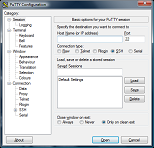
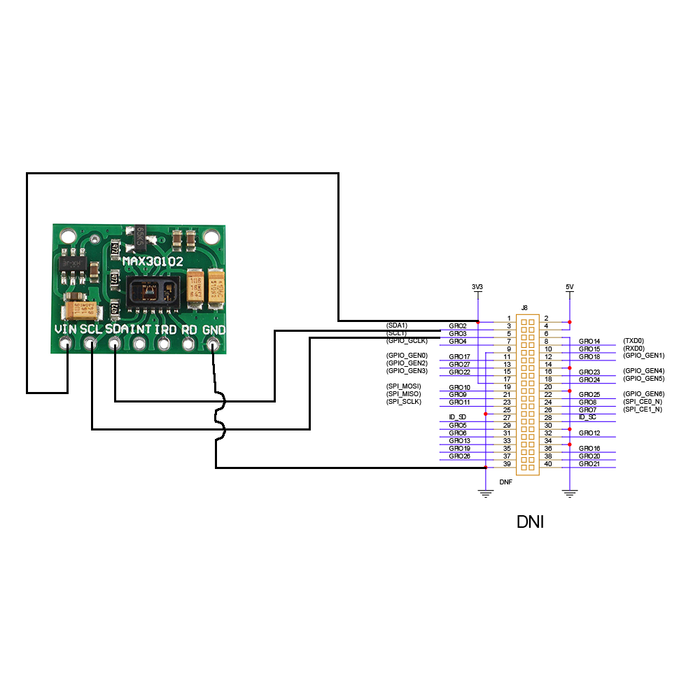
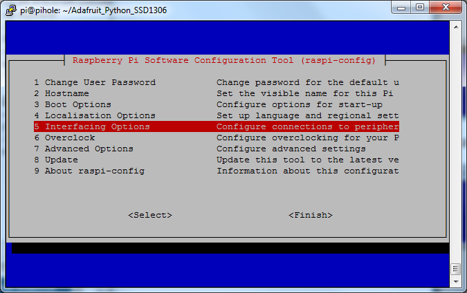
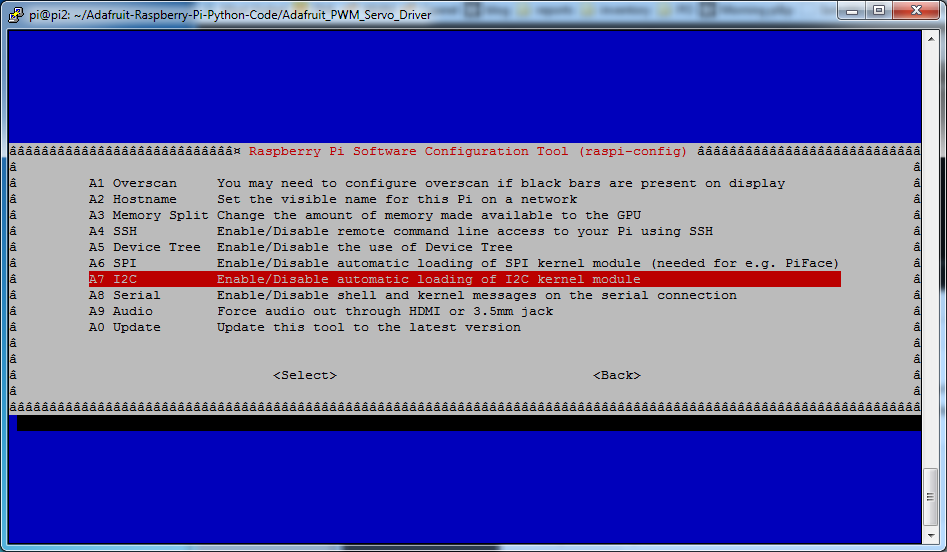

# sailor-savers
Sailor Smartwatch SW Stack

## Raspberry Pi Zero 2 OS Flash

To flash the micro SD card with Raspberry Pi OS, follow this tutorial.

https://www.raspberrypi.com/software/

The Zero 2 is has a 64 bit arm chip, so make sure you choose **Raspberry Pi OS (64 bit)** or **Raspberry Pi OS Lite (64 bit)** from the **Raspberry Pi OS (other)** menu. The **Lite** version only has a commandline interface, so you must access with ssh.


Next, click the gear to open **Advanced Options**.
- Check **Set hostname** and type `raspberrypi`.
- Check **Enable SSH** and choose **Use password authentication**. 
- Check **Set username and password** and create a password, for example `raspberry`.
- Check **Configure wireless LAN** and type your Wifi SSID and Password.


## Connecting with SSH

To connnect to the Pi Zero over SSH, plug in the micro usb from your laptop to the micro usb on the Pi labeled **USB**.

This will create a serial connection over the usb cable between your Pi and laptop.

### Windows
Install putty.

https://www.putty.org/ 



In the **Host Name (or IP address)** box type,

```
pi@raspberrypi.local
```

Then click **Open**.

### Mac / Ubuntu

Use the terminal ssh tool.

``` shell
ssh pi@raspberrypi.local

```

If your Pi is connected to Wifi, you can replace `pi@raspberrypi.local` with the Pi's IP address from the router admin page.

VSCode is another good tool for Windows or Mac / Ubuntu. It can connect via SSH and edit files natively without using Nano.

https://code.visualstudio.com/ 

## MAX30102 Heart Rate / Pulse Ox Sensor

The MAX30201 povides heart rate and pulse ox data with an optical sensor.

### Wiring

To connect the MAX30102 to the Pi, follow this schematic to connect 3.3 V power and I2C.



### I2C

Setup I2C on the Pi according to this tutorial.

https://learn.adafruit.com/adafruits-raspberry-pi-lesson-4-gpio-setup/configuring-i2c 

In the Pi terminal, run the following to install `i2c-tools` and `git`.

``` shell
sudo apt update
sudo apt install i2c-tools git
```

Enable I2C on the Pi

``` shell
sudo raspi-config
```

Select **Interfacing Options**



Then enable **I2C**



Reboot the Pi

``` shell
sudo reboot
```

Check the I2C connection with the MAX30102

``` shell
sudo i2cdetect -y 1
```

You should see a device on address `0x57`

### Python

Install the following pip packages for Python

``` shell
pip install -U pip
pip install numpy smbus
```

Clone the Python project from doug-burrell

https://github.com/doug-burrell/max30102

``` shell
git clone https://github.com/doug-burrell/max30102.git
```

Run the Python script

``` shell
cd max30102
python main.py
```

You should see the light on the sensor come on and a stream of heart rate and pulse ox data in the Pi's terminal.

## LIS3DH Accelerometer

The LIS3DH senses acceleration in 3 axes.

https://learn.adafruit.com/adafruit-lis3dh-triple-axis-accelerometer-breakout/python-circuitpython

### Wiring

To connect the LIS3DH to the Pi, follow this schematic


Note: This circuit can be connected in parallel to the MAX30102 circuit; both will function on the same I2C bus with different addresses. 

### I2C

Check the I2C connection with the LIS3DH

``` shell
sudo i2cdetect -y 1
```

Now, you should see two devices on addresses `0x57` and `0x18`. The first is the MAX30102, the second is the LIS3DH. 

### Python

Create a new file named `acc.py`

``` shell
mkdir acc
cd acc
nano acc.py
```

Paste the following code in nano

``` python
import time
import board
import digitalio
import adafruit_lis3dh
i2c = board.I2C()
lis3dh = adafruit_lis3dh.LIS3DH_I2C(i2c, address=0x18)

# x, y, z = lis3dh.acceleration
# print(x, y, z)

while True:
    if lis3dh.shake(shake_threshold=15):
        print("Shaken!")
```

Then, press **control+x** to exit and **y** to save the file in nano.

Run the script

``` shell
python acc.py
```

You should see the terminal output **Shaken!** when you shake the accelerometer.

